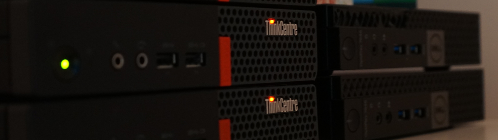

# atHomeBuilds 

This repository will track various possible hardware configurations that can run the [atHomeHub Software stack](https://github.com/athome-hub/software).  
This can be used as examples/starting points when searching for hardware. 

## Before you begin

We don't need a lot of power for what we're doing here. Even if we did, your **local marketplace** will be a great place to get started with your build.  
Most machines are pretty robust, I'd say there are **80%-90% chances to buy used hardware and for it to function properly**.  

Your requirements (CPU Threads, Memory, Storage) will scale depending on which apps you want, how much you use them and how many people use them.  

Here are some thoughts of mine on:  
- [Choosing a CPU](./guides/choosingACPU.md)  
- [Choosing Storage](./guides/choosingStorage.md)  

> [!TIP]
> When looking for a machine, look for one that has:  
> - As many available CPU threads as possible (at least 6 threads)
> - A "decent" base frequency (2-3Ghz)  
> - As much RAM as possibler (16GB and up)  

## The Basics

Here are some things that you'll need regardless of the build. 

- **Router that offers a VPN server. (WireGuard/OpenVPN)**  
  I personally use an [Ubiquiti Cloud Gateway Ultra](https://ca.store.ui.com/ca/en/products/ucg-ultra) due to the simplicity of the unifi controller. As far as I'm aware, more and more mid range routers can run a VPN server.  
- **A switch with some network cables.**  
  Depending on the machines you get, this can be any basic 1Gb/2.5Gb/10Gb switch. Speed will depend on what the machines can support. Get some ethernet cables to plug them all together.  
- **Some USB drives (1 + at least one spare)**  
  We'll use this to install the OS. Have at least a spare in case one fails.  
- **CR2032 batteries**  
  When buying used machines, I usually replace the CMOS battery with a new one, just to ensure my BIOS settings are saved. Good to have a few around.  
- **Spare RAM**  
  RAM issues are the worst and generally a pain... Try to have some good known working ones around, will be good for debugging random crashes/issues if those happen. I upgraded the RAM on my machines and I kept what they came with as spare.  
- **Some dices**  
  Sometimes, no matter how well you prep or do things, it just won't work. Maybe, you're just unlucky? Use these to measure your luck.  

## The Builds

### [theBasic](./builds/theBasic/README.md) - Simple and robust  
  
***A couple machines, some storage and some RAM. This is the setup that I'd recommend for your personal data.***  