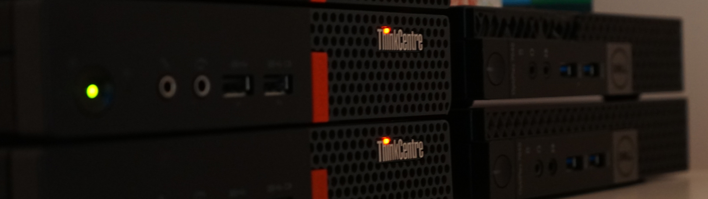

# theBasic  

This will be a **small and simple** setup, focused on storing and handling your personal data.  

> [!NOTE]  
> **Renter friendly setup**  
> The small size of the cluster is important in case you'd ever want to move.  
> You can turn them off, put them in a backpack and move.  

**What you'll need:**  
- [ ] USFF Machines 
- [ ] OS Storage
- [ ] Personal Storage
- [ ] RAM*

## USFF Machines

> [!IMPORTANT]  
> You will need **at least 2** of these machines!  
> Make sure you have **enough components to build both**.  

> [!TIP]
> I first started looking into USFF machines for my clusters after seeing [Project TinyMiniMicro](https://www.servethehome.com/introducing-project-tinyminimicro-home-lab-revolution/) from [Serve The Home](https://www.servethehome.com/).  
> They have a lot of information on these machines, I'd recommend checking some of their videos and check their forums for information on these machines.  

My cluster initially started with 2x **Lenovo M910Q** machines (similar to [this](https://www.servethehome.com/lenovo-thinkcentre-m710q-tiny-guide-and-ce-review/)) with an [i5-6500T](https://www.intel.com/content/www/us/en/products/sku/88183/intel-core-i56500t-processor-6m-cache-up-to-3-10-ghz/specifications.html?wapkw=i5%206500t). They've been **pretty good**, but I have seen pretty high CPU load as I started using them. *Check out the [choosing a CPU](../../guides/choosingACPU.md) section for some details on this.*  

*In the above screenshot, the **left panel shows the CPU Load**.*  
Out of the 8 total available threads, we see constant **spikes around 12** for the entire cluster (10 on the node), whereas the CPU usage remains somewhat stable and is under 100%. 
When I noticed this, I decided to add another machine, a [Lenovo M720q](https://www.servethehome.com/lenovo-thinkcentre-m720q-tinyminimicro-feature/), to better distribute the CPU load. This is how it looks afterwards:  

CPU **Load still spikes**, this is how it looks across each node

I'm unsure what is causing the periodic load on the system, as there is very light usage especially during work hours. The only recurring task I have is the ["Nextcloud Background Jobs"](https://docs.nextcloud.com/server/latest/admin_manual/configuration_server/background_jobs_configuration.html) (which runs as a single process despite the plural), which runs every 5 minutes.  
I'm thinking that this issue is either this putting some pressure on the disks, Longhorn keeping the disks in sync, or the Postgres clusters keeping in sync. I wrote a bit more about this [here](./issues.md)

**If I were to start over, I would search for machines that have an 8th gen i5 or newer (or equivalent AMD).**  

> [!TIP]
> **Price** will depend on what you can find. I would suggest trying to **find these machines locally**, try your local marketplace first and then eBay for a wider search. There are also shops that resell these, those could be a good starting point as well.  
> Regardless of how you get them, **be somewhat prepared to**:
> - change the CPU thermal paste  
> - perform various upgrade (Storage, RAM)  
> 
> ***Treat these as "work horses", we need them to run our processes. Set a budget and see what's the most powerful machine that you can find within that budget, regardless of looks or brand.***  

**Start small and grow as needed.** Do **not invest a lot of money** until you know this is something that brings value to you and you're prepared to invest some time into maintaining these.  

To deal with actual [data storage](../../guides/choosingStorage.md), we'd also need to ensure that **the machine has at least 2 ports for storage**, you might need to look for something with either:  
- 2x M.2 Slot
- 1x Sata SSD and 1x M.2 Slot

This will also impact the way you search for storage, you will either need 2x M.2 SSDs, or 1x M.2 SSD and 1x SATA SSD for either personal storage or OS storage. **Check my thoughts on storage [here](../../guides/choosingStorage.md).** 

Any modern enough USFF machine will usually have 2 available storage slots, a slot for a SATA SSD, and another M.2 slot.  
**You can still find without, so pay attention to what you're buying!**  
I have a few Optiplex 3040 Micro that do not have support for M.2.  

> [!CAUTION]  
> **WiFi slot to M.2**  
> You **cannot find high endurance 2230 NVMe SSDs**, which forces any drive used the way described below to act as OS Storage.  
> 
> You might be able to adapt the wi-fi slot to fit a 2230 (small) M.2 SSD that can be used for OS Storage, but some devices cannot boot from them.  
> I have a Lenovo M720Q machine which **doesn't allow me to choose the drive as a boot device**. It **works, but unsure why**. Others have reported similar issues for other Lenovo machines. Check [reddit](https://www.reddit.com/r/homelab/comments/15dgbxo/lenovo_m720q_boot_drive_wifi_pcie/?rdt=44152) and [servethehome](https://forums.servethehome.com/index.php?threads/lenovo-thinkcentre-thinkstation-tiny-project-tinyminimicro-reference-thread.34925/page-42).  
> You might also **have issues** when the machine doesn't have another M.2 slot. I had a Dell Optiplex 3040 micro, withouth the M.2 slot and the firmware was missing the parts it needed to use the M.2 as a boot device, although the OS would see the drive.   

> [!WARNING]  
> When purchasing these, if the **machine has a SATA SSD port, make sure that the caddy (holding/mounting thing) is included with the machine!**  

Purchasing notes: 
- **Search for these first before buying anything else.** They might come with enough RAM and a small storage device that could be used for the OS.
- Expect personal storage to be bought separately. 

## OS Storage
Check the [storage guide](../../guides/choosingStorage.md) for tips on how to choose storage.  

For OS storage we'd need **a dedicated storage device** that's **at least 256GB**. The machines might have these already included. If possible, try getting a 512GB drive. This device is used for OS related storage (60GB) and system related data, such as metrics and logs. The more storage you have, the longer retention on the metrics you can have.  
If the machine came with storage, **try finding the drive spec sheet** with the endurance numbers and check the drive to see how much usage it reports.  

> [!IMPORTANT]  
> Control-plane node is generally more difficult to change the storage of. **If possible, try to have a drive with a higher endurance for this node**.  
> Worker nodes are more lenient, the failing drive can be replaced and the OS reinstalled, without worying about recovering data.  

This is how much I have written to my OS Storage over the past 3 months

With an overly estimated 2TB written per month, your **average 256GB NVME drive** with an endurance of 160TBW **should last around 6 years**. 

## Personal Storage
Check the [storage guide](../../guides/choosingStorage.md) for tips on how to choose storage.  

This is how much I have written to my Personal Storage over the past 3 months  

The importance of disk writes is discussed in the Storage guide.  

Besides the endurance of the disk, think about how much data you actually have to deal with. You can check your current usage across all the devices you'd want to use with this service and try to find a disk that can fit all those.  

If going the enterprise route, it might be worthwhile finding bigger devices from the beginning (4TB+) and sticking with those for a few decades.  

> [!IMPORTANT]  
> You will be limited to how much you can store, based on the size of your drive.  

## RAM (Memory)

Anywhere **betwen 16GB - 32GB** of available RAM memory should be fine. Ensure that you have some spare around in case you start having random, relatively weird issues with the machines, as those might be RAM related.  

Your options are basically
- 2 x 8GB RAM  
- 2 x 16GB RAM  

In terms of **frequency, higher is better**, but I generally **buy whatever I find**. As long as each machine **gets a matching pair, you should be fine**.   

> [!NOTE]
> RAM issues are the worst... They can vary from the machine not starting at all (best case) to random crashes, freezes and general "weirdness".  
> I have some spares around which came in handy when one of my workers started randomly freezing.   

Might be worth, trying to get them in bulk, DDR4 RAM might still be relevant for a bit, especially if buying used hardware. I managed to get a decent price on 10x pieces, 16GB each.  

**32GB of RAM might be a bit much**, here is how my memory usage looks on my nodes:
  
*green - used | yellow - buffers | blue - cached*  

> [!IMPORTANT]  
> Caches are probably used by the Postgres databases. That part of the memory is **still considered available** and made available to any process that needs it.  
> **Usage is between 7-12 GB.** 
