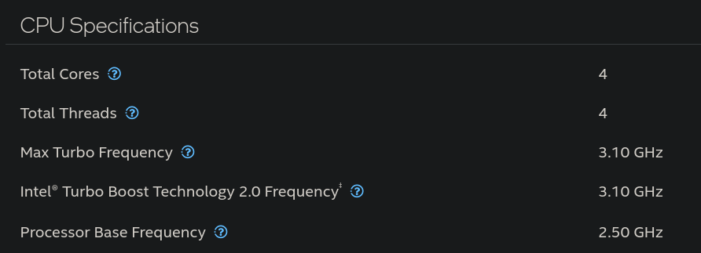
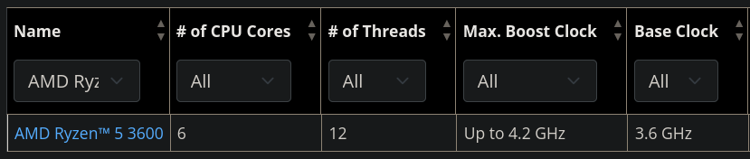

# Choosing a CPU

You might not have the luxury to actually "choose" a CPU, but as you're browsing your local marketplace, you will find different machine variations, with different configurations of CPU, Memory or Storage. 

> [!IMPORTANT]  
> Some machines (up to 8th gen intel, maybe?) have a socketed CPU.  
> This means that you can replace the CPU after you bought the machine.  
> Newer machines will have the CPU soldered to the motherboard, which means that you will never be able to replace it (similar to laptops).  

## CPU Load  
*In a server use-case, you will always have a higher CPU load than CPU usage.* 

> Think of the CPU load as time reservations to use the CPU. **Each process** as it needs to... process, **will require time on the CPU** to do said processing. The total amount of time that the processes spend processing on the CPU is the total system (CPU) load.  
> Every time the **CPU load goes over the total available threads, processes will wait** for their turn, meaning that some processes might respond slower as they wait for available CPU time.  

There are 2 ways to deal with a high CPU load:
- **Get a CPU with a higher number of threads (cores)**  
    This ensures that there is space for all processes to process, decreasing the chance of wait times.  
- **Get a CPU with a higher frequency**  
    A higher CPU frequency means that the processes will finish their processing faster, allowing other processes to start using the CPU quicker, decreasing the overall load.   

> [!TIP]  
> Try to find a machine with a CPU that has a higher number of threads as it's an easier solution for the CPU Load.    
> Applications might not be able to take advantage of a higher CPU frequency during their processing.  

CPU Load can go over the amount of available threads for short spike durations. Long lasting high CPU load (over 30-60s) will have an impact on application performance and responsiveness.  

## Finding CPU Specs

For **Intel CPUs**, check [intel ark](https://www.intel.com/content/www/us/en/ark.html#@Processors) and look for the `CPU Specifications` section, it should look like below:  
  
For **AMD CPUs**, check [AMD Processor Specifications](https://www.amd.com/en/products/specifications/processors.html). It should look like below:  

