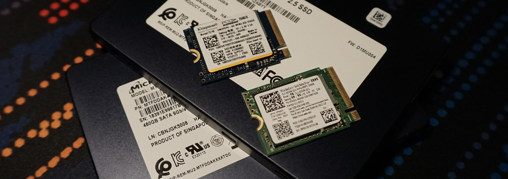
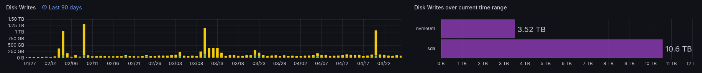
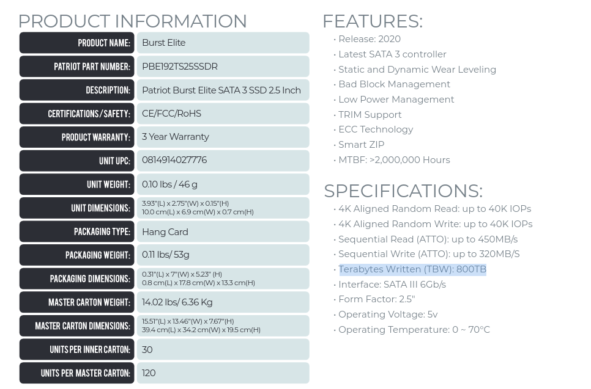
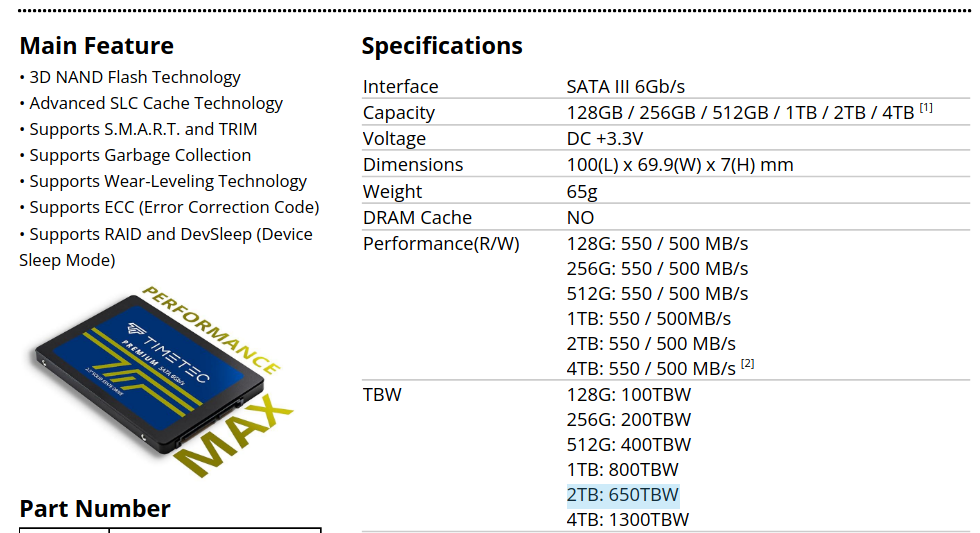
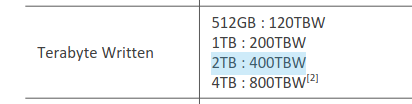
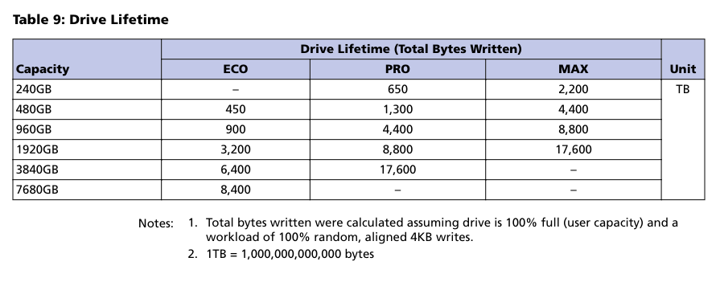

# Storage

We would generally have 2 types of storage:  
- OS Storage
- Data Storage

## Choosing your storage 

> [!NOTE]
> I generally search for drives with a higher endurance (higher number of writes until it fails).  
> > *For instance, if a consumer SSD has 300 TBW, and I write about 1TB per month, that would last around 25 years. But if I'm writing more data, like 10TB a month, it might only last two-three years.*

This is how my writes are looking like over the past 3 months.  

>[!IMPORTANT]
> **High spikes** in writes are due to the **replica rebuild on the disk**. These happen **ocasionally** and I will keep them in the calculation, although they might have been due to me interacting "more" with the cluster than I should have.  
> I prefer to **air on the side of caution** and just include these as part of "normal" behaviour.    

In my use case:  
- On the **OS Storage** I have written 3.52TB.  ~ **1.17TB / month**  
- On the **Data Storage** I have written 10.6TB. ~ **3.5TB / month**

With this data, if the disk has a 300TBW:  
- The **OS Storage** disk should last ~ **21 years**
- The **Data Storage** disk should last ~ **7 years** 

### Possible storage options

#### Starter pack  
*You can get yourself started with some new cheap SSDs, but keep in mind that they will fail quicker than others.*

I compared 3 relatively cheap 2TB SSDs (120$-150$ CAD) off of Amazon that could be used for data storage, below are the spec sheets and what they claim that the endurance on the drives is:  

|        |        |
|--------|--------|
|  |  |

These should last as follows:  
- Patriot Burst Elite 1.92TB SSD ~ 19 years 
- Timetec 2TB SSD ~ 15 years
- Teamgroup QX 2TB SSD ~ 9 years

#### Used enterprise  
*This is a more involved process, you'll need to pay attention to what youget and make sure you get stats related to how many writes were done on the disks.*

> [!IMPORTANT]
> **Buying used storage can be tricky.** Ask the seller to provide TBW values and search the spec sheet to understand how much headroom you have.  
> You might have luck with these drives if you buy from an electronics recycler, as they might buy them directly from the enterprise seller, but **there's always a chance of getting heavily used drives**, close to their limit.  
> **These might be more expensive that the new, cheap SSD options!** 

I prefer to take a different approach to buying stuff in general, storage is no different. I spent some time on eBay and found 3x 2TB Micron 5100ECO drives. These had between 250-350TBW total, close to how many writes the new drives offer before they fail.   

Spec-sheet on the Micron 5100 shows the following:

This show that my 2TB ECO drives have a total expected lifetime of 3200TBW. Considering their use, when I bought them, they had around 2800TBW left.  
**The used 5100 ECO drives should offer me ~ 66 years before they fail.**

#### New enterprise (high-endurance)  

This is a very expensive option, but if you can afford it, you might be able to buy a set of SSDs and for those to last a lifetime.  
These would be available from vendors such as Samsung, Micron, Kioxia, Intel, etc.  

## Drive Types

### 2.5" SATA SSD

The classic and well known storage option, these are the ones that I've compared above. These are usually slower than M.2, but might be found cheaper and with a higher endurance for big storage requirements (2TB+).  

I prefer these for data storage applications.  

### M.2 NVMe SSDs 

> [!WARNING]  
> M.2 SSDs can come in both PCIe (NVMe) and SATA forms.  
> We're interested in the NVMe variants, this should be clearly seen somewhere on the label. 

